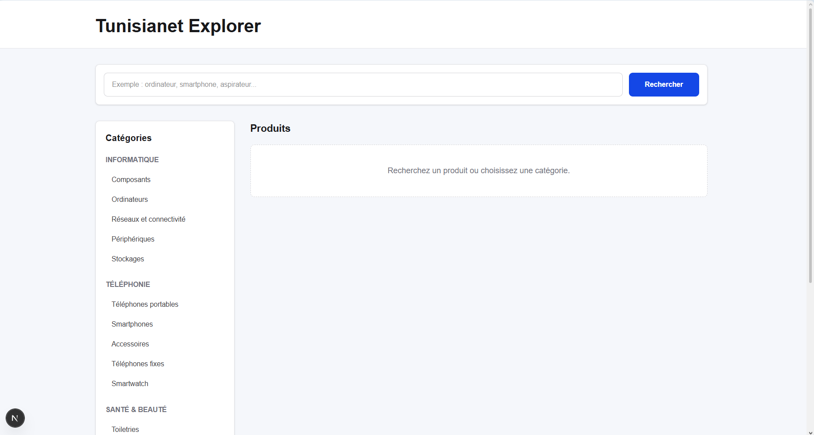
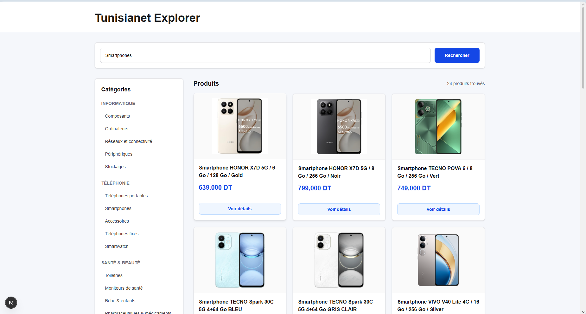
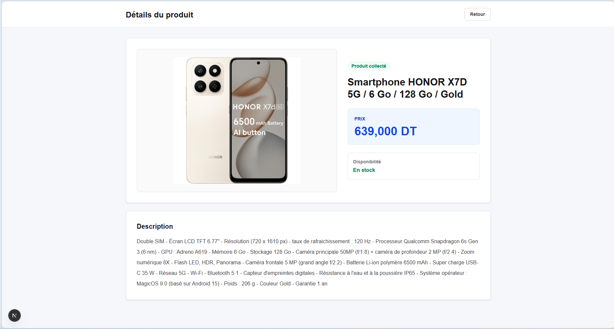

# Tunisianet Explorer

Application web full-stack développée avec **Go (Echo)** et **Next.js** permettant de rechercher des produits sur Tunisianet, parcourir les catégories et consulter les détails d'un produit.

## Aperçu

### Page d'accueil



### Résultats de recherche



### Détail d'un produit



## Fonctionnalités

- Recherche de produits par mot clé.
- Navigation par catégories.
- Affichage des produits avec image, nom et prix.
- Page détail avec image, prix, disponibilité et description.
- Architecture frontend/backend séparée.
- Interface responsive.

## Technologies

| Technologie | Rôle |
| --- | --- |
| Go | Backend |
| Echo | API REST |
| GoQuery | Scraping |
| Next.js | Frontend |
| TypeScript | Typage |
| Tailwind CSS | Interface utilisateur |

## Architecture

```text
Frontend Next.js
       |
       | HTTP
       v
Backend Go / Echo
       |
       | Scraping
       v
Tunisianet avec GoQuery
```

## Structure du projet

```text
backend/   API Go, routes, handlers, models et scraper
frontend/  Interface web Next.js
docs/      Captures d'écran du projet
```

## Installation

### Prérequis

- Go
- Node.js
- npm

### Backend

```bash
cd backend
go mod tidy
go run .
```

Le backend démarre sur `http://localhost:8080`.

### Frontend

```bash
cd frontend
npm install
npm run dev
```

Le frontend démarre sur `http://localhost:3000`.

## API

```http
GET /products?search=ordinateur
GET /product/details?url=<product-url>
```

## Vérification

Backend :

```bash
cd backend
go test ./...
```

Frontend :

```bash
cd frontend
npm run lint
npm run build
```

## Auteur

**Haythem Dridi**

Projet réalisé dans le cadre d'un mini-projet de stage.
